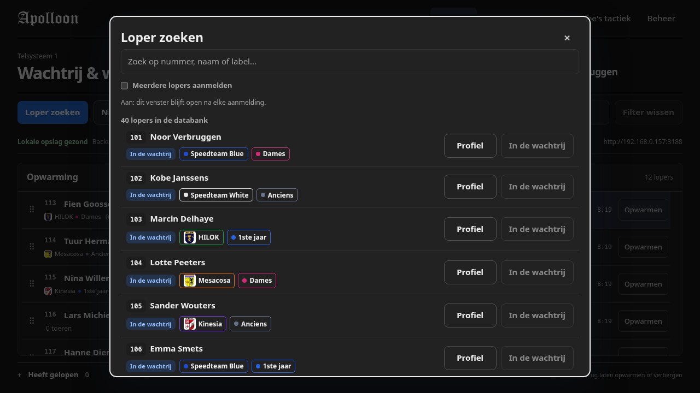
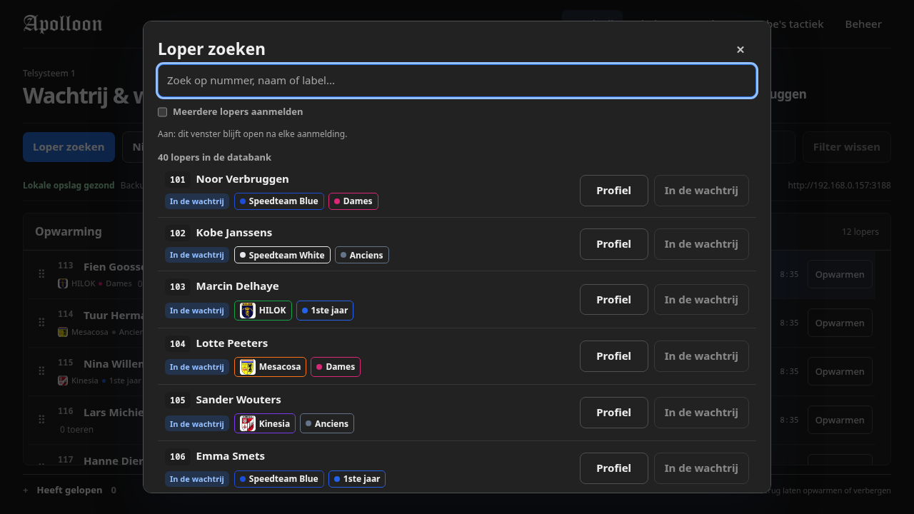
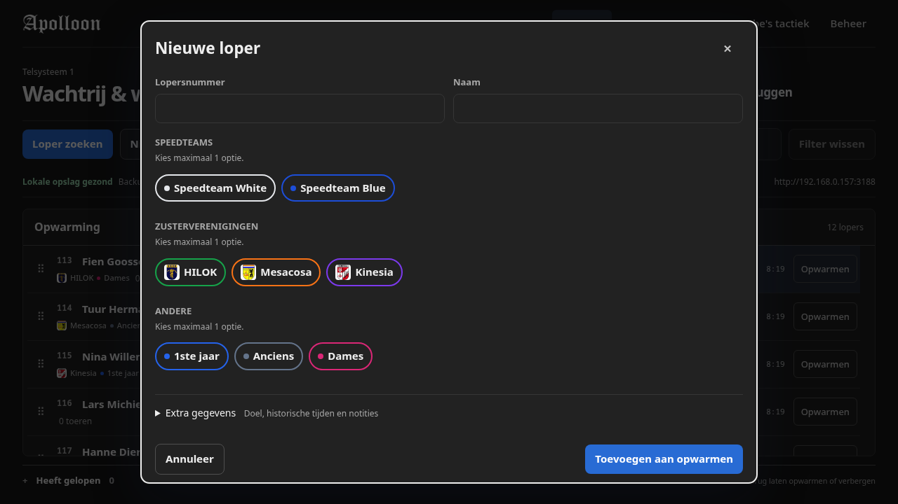
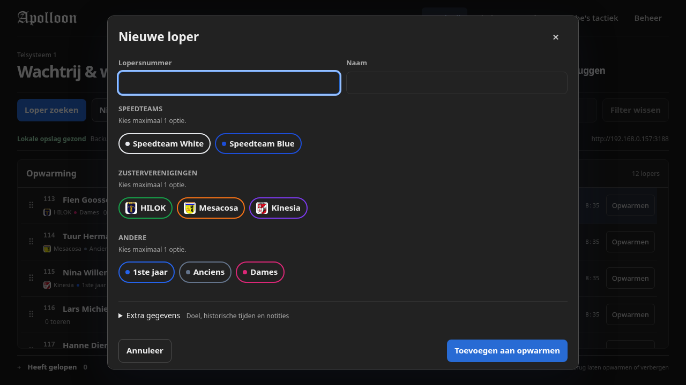

# Dialog initial focus evidence

## Revisions and setup

- Base: `a2dc52b` (`main`)
- Implementation: `a7040e1` (`fix/dialog-initial-focus`)
- Route: `/queue`
- Viewport: 1280 x 720
- Data: disposable `ready` seed with 40 runners and 8 labels
- Browser: Google Chrome 153, headless
- Time: frozen to the same instant for both revisions

Both screenshot pairs use the same route, viewport, seed, and freshly opened dialog. The blue outline in the changed screenshots shows the input that receives keyboard input immediately after the opener button is pressed.

## Loper zoeken

| Before | After |
| --- | --- |
|  |  |

On the base revision, focus landed on the dialog content container and typing `113` left the search field empty. On the changed revision, the search input is active and the same keystrokes enter `113` in that field.

## Nieuwe loper

| Before | After |
| --- | --- |
|  |  |

On the base revision, focus again landed on the dialog content container and typing `501` left `Lopersnummer` empty. On the changed revision, `Lopersnummer` is active and the same keystrokes enter `501` in that field.

## Audit and verification

The focused browser check in `scripts/validation/dialog-ui.mjs` now asserts both the active element and direct keyboard entry for these two dialogs. It also rechecks focus containment, Escape handling, draft protection, nested dialogs, and returning focus to the opener.

The remaining dialog-like flows were reviewed:

- The temporary-team member picker already focuses its search input and accepted `Noor` without an extra click in the same browser session.
- The runner profile opens for viewing and editing several fields, so it has no single typing target.
- Race completion and unsaved-change dialogs ask for a choice rather than text input.
- Persistent page filters remain unfocused on navigation because they should not take focus away from the page heading or operator controls.

Screenshots show the visible focus state. The automated browser assertions establish which element actually receives keystrokes.
