# Runtime and modules evidence

## Revisions and setup

- Base: `44015ef` (`main`)
- Implementation: `refactor/runtime-and-modules`
- Route coverage: `/queue`, `/admin` (5 sections), `/tactics` (live + 5 historical sections)
- Viewport: 1366 x 768
- Data: disposable `ready` seed (40 runners, 8 labels, race not started, 0 laps),
  served with the same data directory on both revisions; `/api/state`,
  `/api/cluster/status`, and `/api/history?scope=full` mocked from a frozen
  fixture so both revisions render identical data
- Browser: headless Chromium, `Europe/Brussels` timezone

Run: `scripts/validation/runtime-refactor-ui.mjs [before|after]`
with `APOLLOON_TEST_URL`, `PLAYWRIGHT_MODULE`, and `CHROMIUM_EXECUTABLE` set.
The script asserts queue search survives navigation, clears correctly, every
admin and tactics section renders, and no page errors occur.

Note: the frozen fixture has no started race, so the tactics live tab shows its
pre-race empty state on both revisions. The bundled Quivr 2025 reference loads
from the live server once the historical tab opens.

## Queue search (zustand removal)

| Before | After |
| --- | --- |
|  | 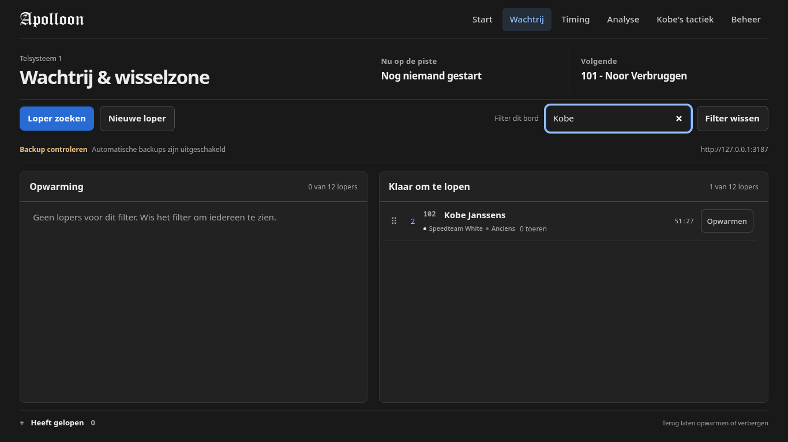 |

Filter `Kobe` renders the same rows before and after. The automated check also
confirms the filter value survives navigation to Beheer and back, and that
`Filter wissen` clears it. The shared search field now lives in a dependency-free
external store (`src/store.ts`) instead of zustand.

## Admin preparation

| Before | After |
| --- | --- |
| 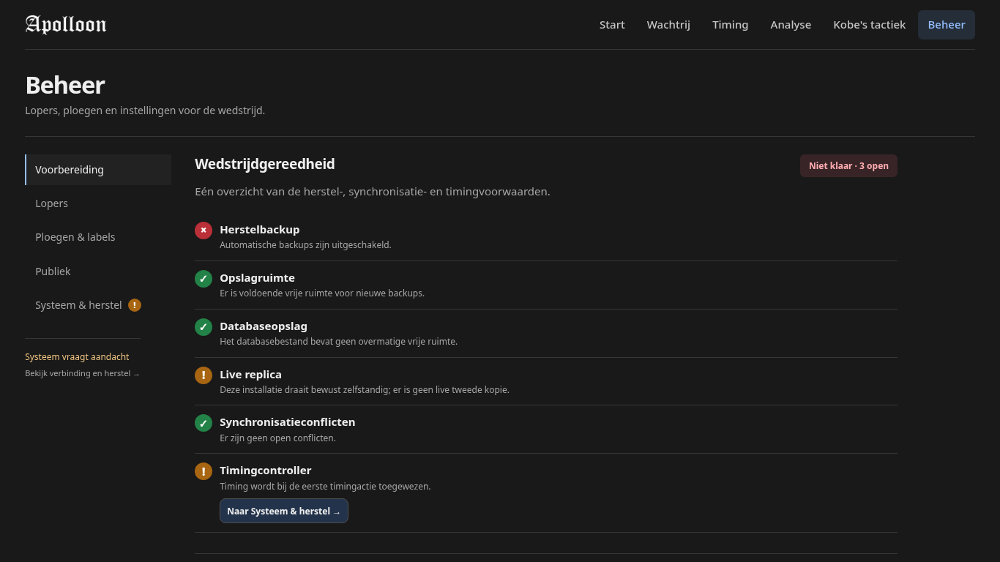 |  |

## Admin runners

| Before | After |
| --- | --- |
| 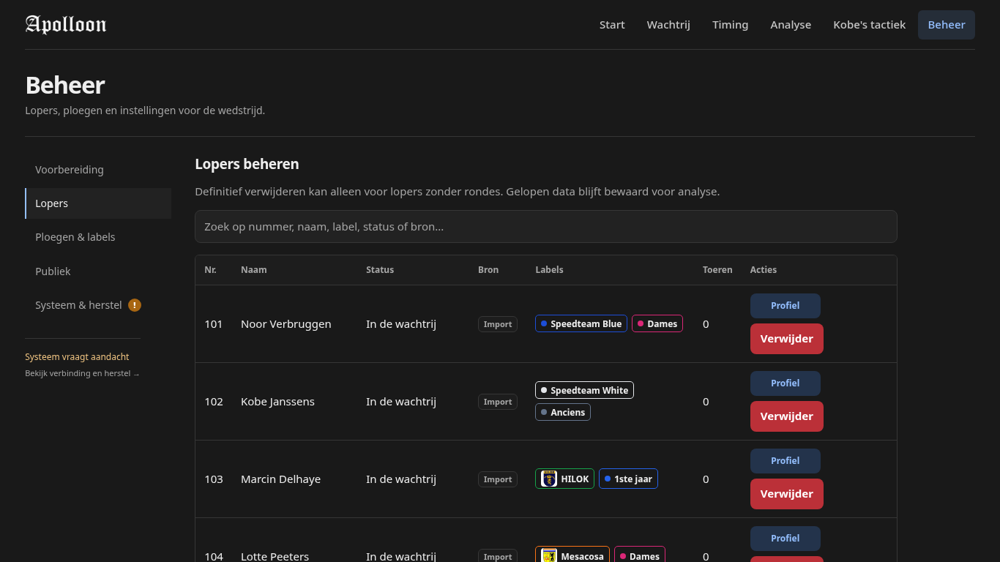 |  |

## Admin labels

| Before | After |
| --- | --- |
|  | 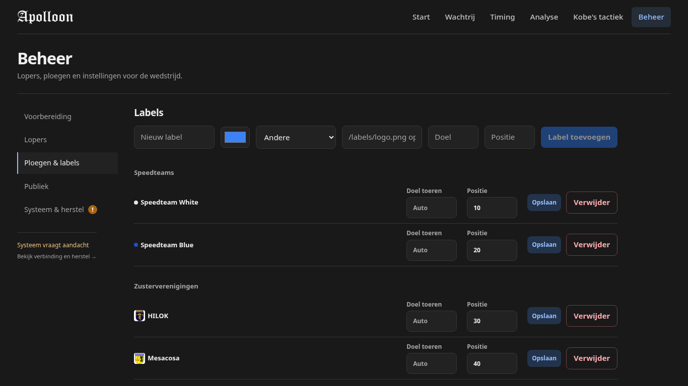 |

## Admin public

| Before | After |
| --- | --- |
|  | 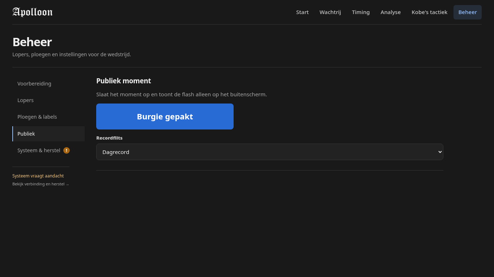 |

## Admin system

| Before | After |
| --- | --- |
| 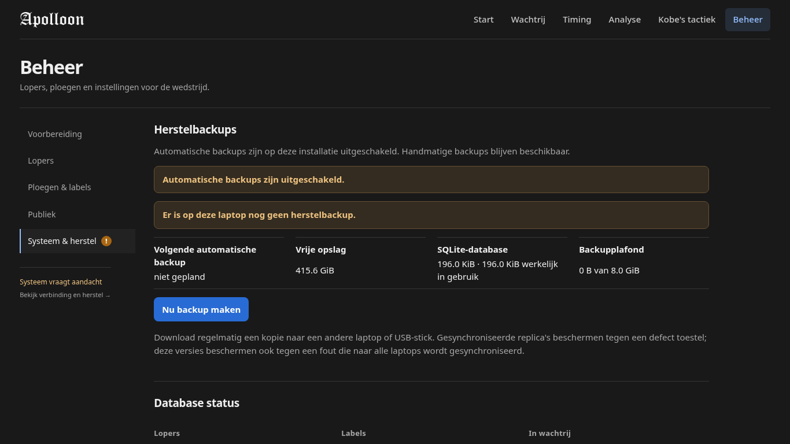 |  |

`AdminView.tsx` went from 1416 to 894 lines. Presentation and team-management
components moved to `src/components/admin/` (`adminFormat`, `AdminRunnerTable`,
`LabelAdminRow`, `TemporaryTeamAdminCard`, `RunnerIdentity`) without behavior
changes; all five sections render identically.

## Tactics live

| Before | After |
| --- | --- |
| 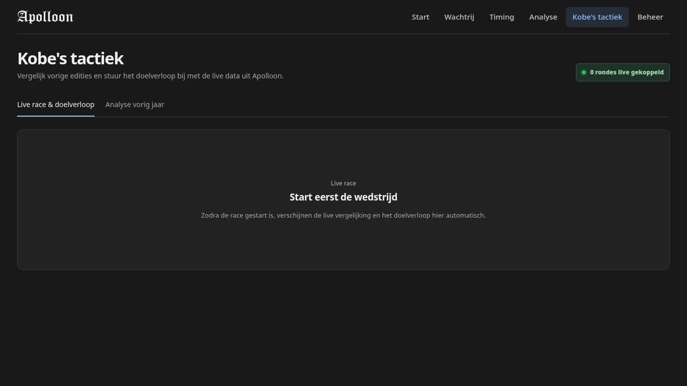 |  |

## Tactics historical overview

| Before | After |
| --- | --- |
|  | 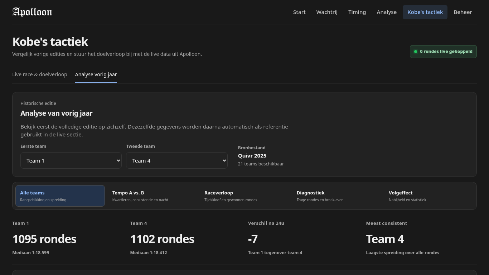 |

## Tactics tempo

| Before | After |
| --- | --- |
| 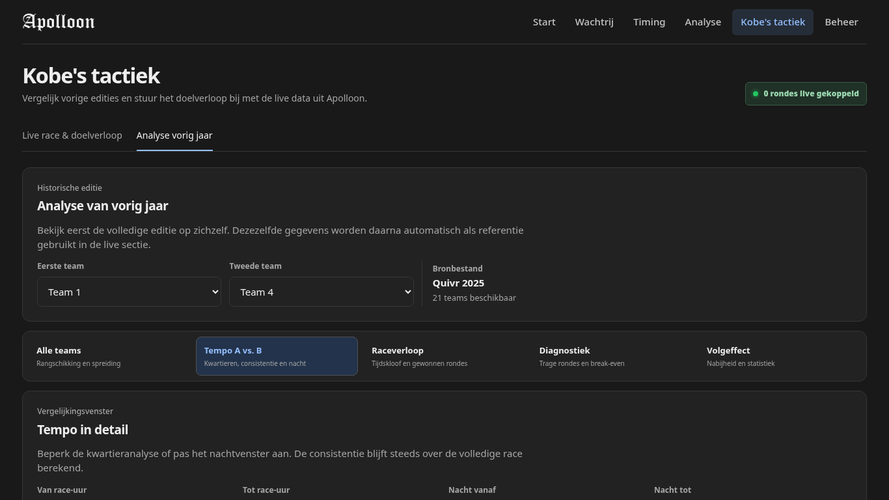 |  |

## Tactics race

| Before | After |
| --- | --- |
|  | 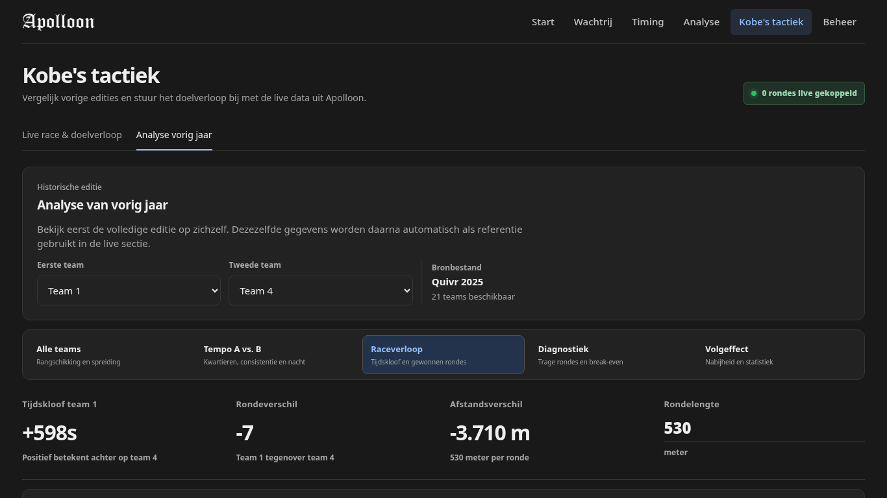 |

## Tactics diagnostics

| Before | After |
| --- | --- |
| 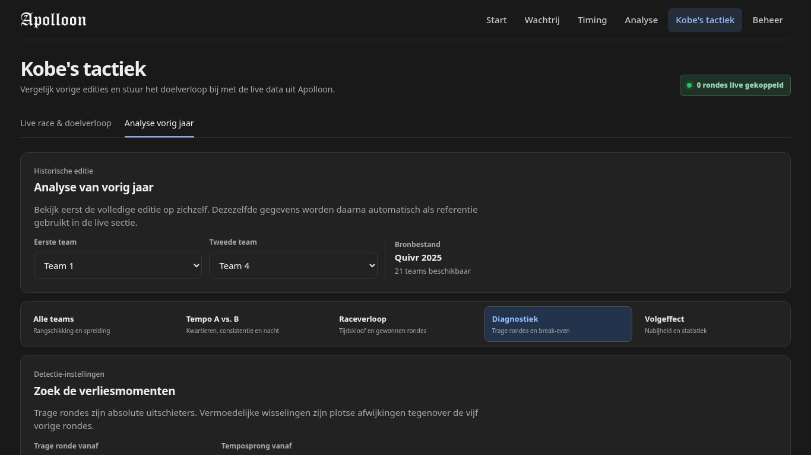 |  |

## Tactics drafting

| Before | After |
| --- | --- |
| 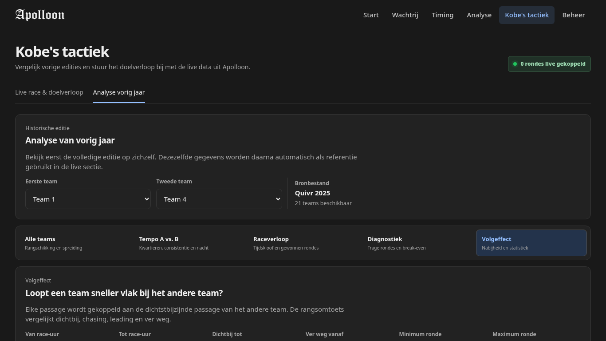 |  |

`KobeTacticsView.tsx` went from 1134 to 545 lines (charts to `tacticsCharts`,
tables to `tacticsTables`, historical panels to `HistoricalPanels`, storage and
formatting to `tacticsFormat`). `HistoricalDeepDive.tsx` went from 1228 to 530
lines (all chart rendering to `deepdiveCharts`). `server/db.ts` went from ~3300
lines to a 57-line facade over `server/db/` modules. No database schema, stored
data, or API contract changed.

## Audit and verification

- `npm test`: 58/58 pass (includes electron packaging, cluster, backup,
  storage, tactics suites)
- `npm run build`: client typecheck, Vite build within budget, server build pass
- `tests/electron-config.test.ts` now also pins Electron 44, `@types/node` 22,
  `engines.node` 22.12, and the matching `allowScripts` entry
- `scripts/validation/runtime-refactor-ui.mjs` passes on both revisions with
  zero browser errors
- Electron 44 keeps the existing `better-sqlite3@12.11.1` prebuilt-binary path;
  `electron/main.js` uses only stable APIs unchanged since Electron 41
- API ownership for new features is documented in `docs/api-contracts.md`
  (tRPC writes, HTTP reads/exports, Socket.IO push-only deltas)
