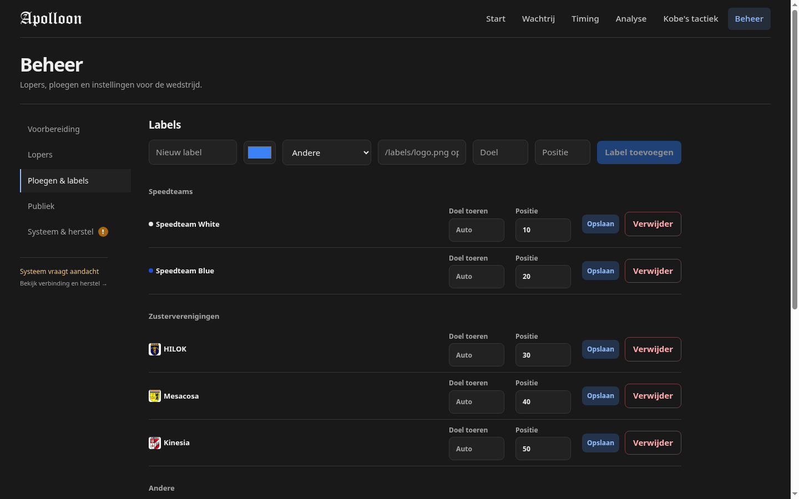
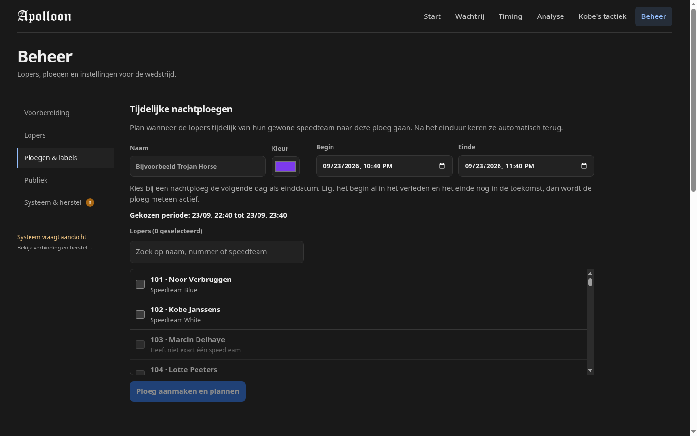
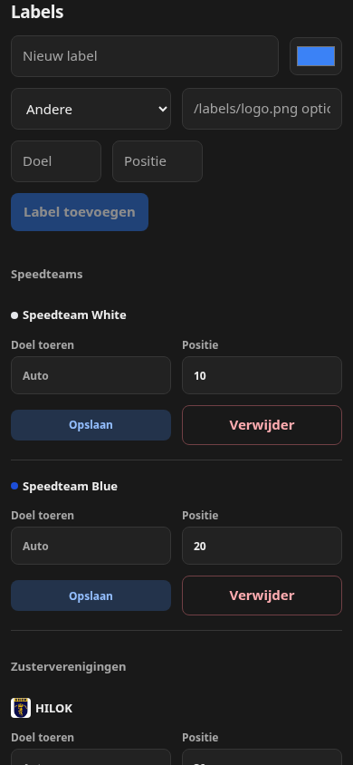
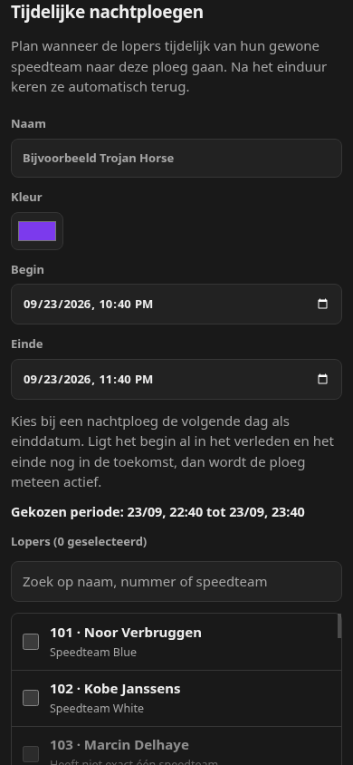

# Tijdelijke nachtploegen plannen

Both captures use `/admin` with the `Ploegen & labels` section selected, the same disposable `ready` seed (40 runners, 8 labels, no temporary teams), and the same scroll anchor at the start of the management content. The desktop viewport is 1440 × 900; the narrow viewport is 390 × 844. The base is `origin/main` at `7e278ea`; the changed version is `feature/temporary-team-scheduling`.

| Viewport | Before | After |
| --- | --- | --- |
| Desktop |  |  |
| Narrow |  |  |

The scheduled team flow is now the first section. Operators set the name, colour, start, end and members together; the local date preview disambiguates the browser's date input. The narrow viewport stacks the fields without horizontal overflow. The screenshots show the initial empty form; the API and cluster E2E tests cover creation, immediate activation, scheduled transitions, restart persistence, and restoring ordinary teams.

Capture used headless Google Chrome 153 against the production client build and a disposable backend database. The same browser viewport, route, data seed, and section state were used for the base and changed capture.

An additional browser smoke check filled the name, selected runner 101, and submitted the form with its default start time in the past. `/api/state` then showed the new team active with one member. The disposable database used for this check was removed afterward.
